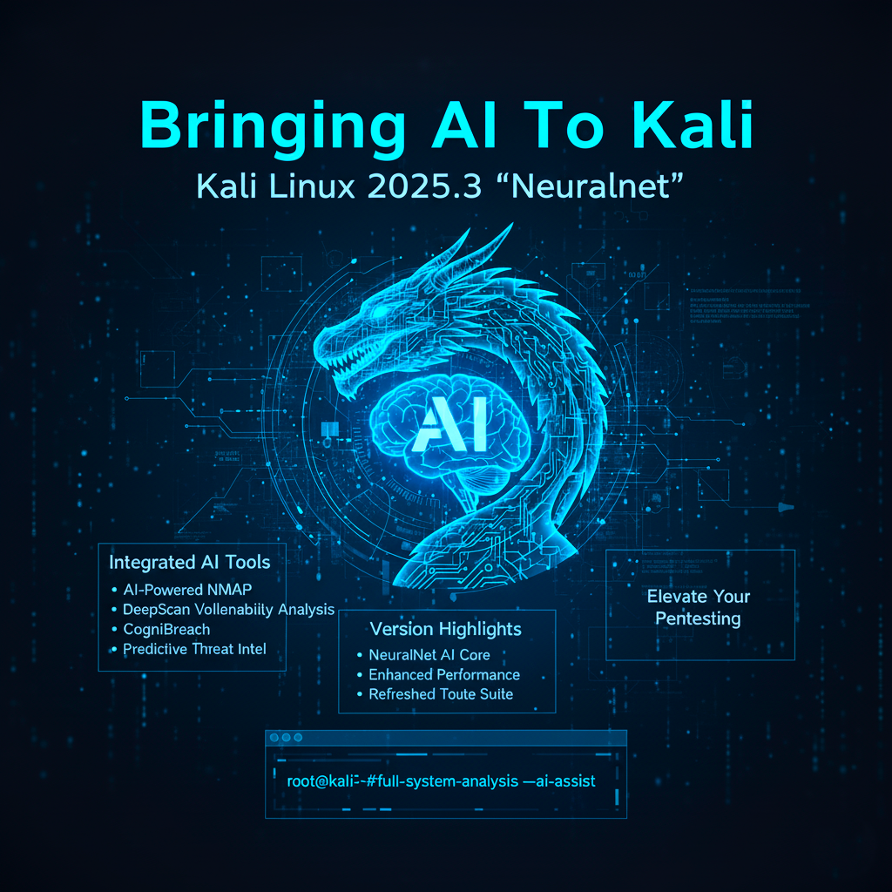

# Kali Linux 2025.3 "NeuralNet"



🚀 **Kali Linux 2025.3** introduces AI-powered penetration testing and security auditing.  
This release is a leap forward, integrating machine learning into offensive security workflows.

## 🔥 Highlights
- Integrated AI tools for reconnaissance & exploitation  
- Smarter pattern recognition and predictive analysis  
- New & updated utilities  
- Performance enhancements

## 🛠️ New Tools & Commands

### AI-Nmap
```bash
ai-nmap -A 192.168.1.0/24 --ai-suggestions
```

### AGImap
```bash
agimap -u https://target.com --deep
```

### DeepScan
```bash
deepscan -t https://target.com -m full
```

### DeepBreach
```bash
deepbreach --target 192.168.1.10 --auto-exploit
```

### NeuroRecon
```bash
neurorecon -d targetdomain.com -o report.json
```

---

## 📌 Author
Created by **Rahul Limbad**
